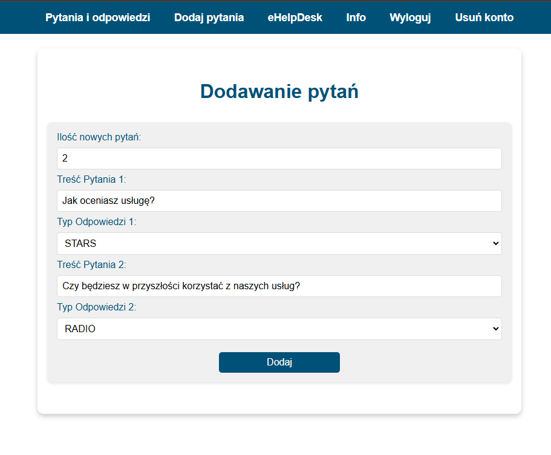
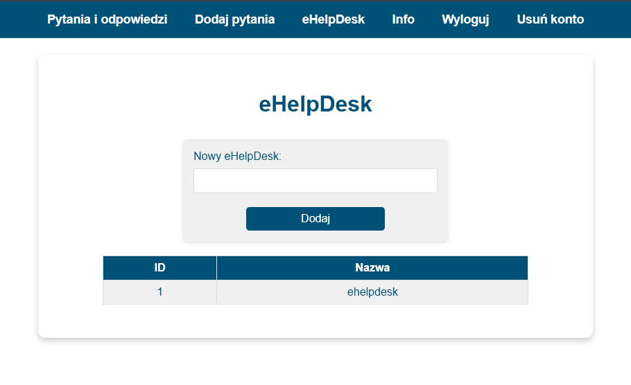
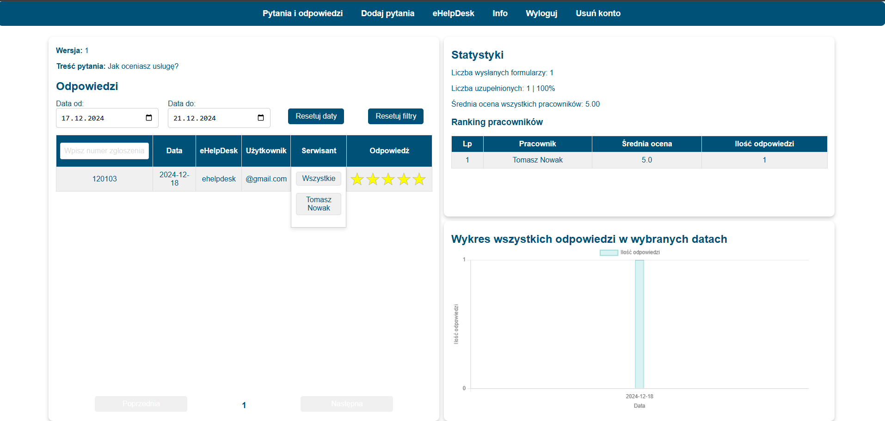
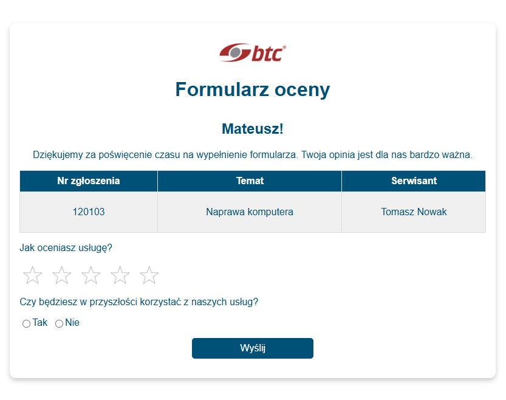

# Employee Feedback System - Email Service

This Polish web-based system facilitates the collection and analysis of employee opinions within an organization. Developed during an internship at BTC company using Java Spring and Svelte, it includes an admin panel for managing surveys and helpdesks.

Employees receive a unique feedback form link via email, ensuring easy and direct access.

## Features

    
    

### User Interface
- **Java Spring Backend**: Provides robust API endpoints for data processing and interaction with the database.
- **Svelte Frontend**: Fast user interface built with Svelte, ensuring a smooth user experience.

### System Workflow
1. **API Requests**: The system sends an API request to a designated endpoint containing data formatted in JSON.
2. **Data Processing**: Upon receiving the data, the system processes it, creates an event in the database, and sends an email with a form link to the client.
3. **User Authentication**: The system supports user registration and login functionalities, including password recovery.
    - **Domain Restriction**: Registration is restricted to emails within the `@btc.com.pl` domain, as the application was specifically developed for BTC company.

### Administrative Panel
- **Full Control**: The administrator has full control over the system.
- **Helpdesk Management**: Ability to add and manage helpdesks within the system.
- **Survey Creation**: The administrator can create question sets where responses can be collected in the form of star ratings or simple Yes/No answers.
- **Data Insights**: The administrator can view responses to specific questions, access response statistics, and view rankings of the best-performing employees.

## Installation and Setup

To run this project locally, follow these steps:

1. **Development Environment**:
    - Recommended IDE: IntelliJ IDEA.
    - Required Java Version: Java 17 JDK.

2. **Database Configuration**:
    - Create a PostgreSQL database named `emailService`.

3. **Backend Setup**:
    - Configure `application.properties` and run a project.

4. **Frontend Setup**:
    - Ensure Node.js is installed.
    - Navigate to the `svelte-app` directory.
    - Ensure to set a backend url in `store.js`.
    - Run the `npm install` then `npm run dev`.

## Usage

- After launching the website:
    1. Open your browser and go to `/admin` (e.g., `http://localhost:5001/admin`).
    2. **Register** using your `@btc.com.pl` email (for the presentation, registration from any domain is enabled).
        - **Note**: To restrict registration to `@btc.com.pl`, uncomment the lines in the `adminRegistrationController`.
    3. Create survey questions.
    4. Set up a helpdesk.

## API Usage

- **Important**: During a POST API request for submitting a form:
    - The **set version** and the **helpdesk ID** must match the ones added in the admin panel.
    - The required **body** for sending the form can be found in the admin panel under the **INFO** tab after logging in.
